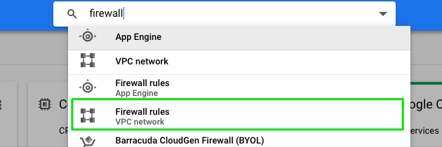
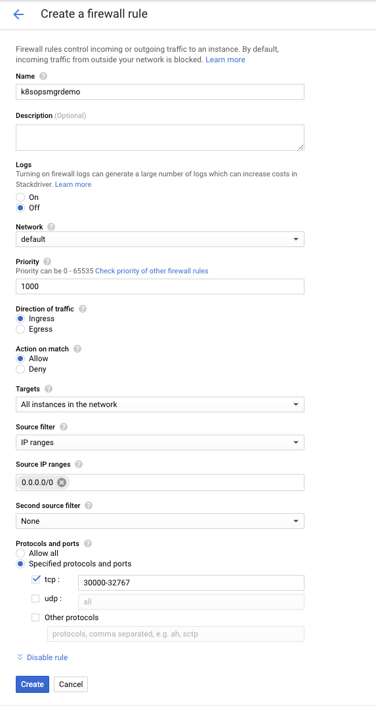
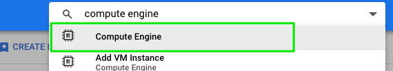
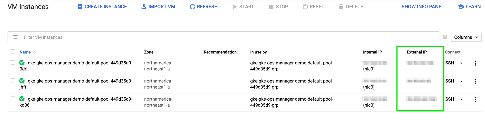
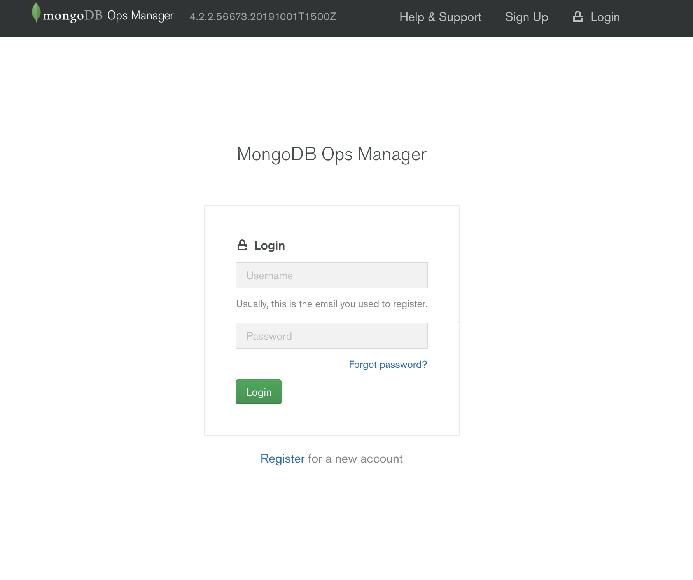
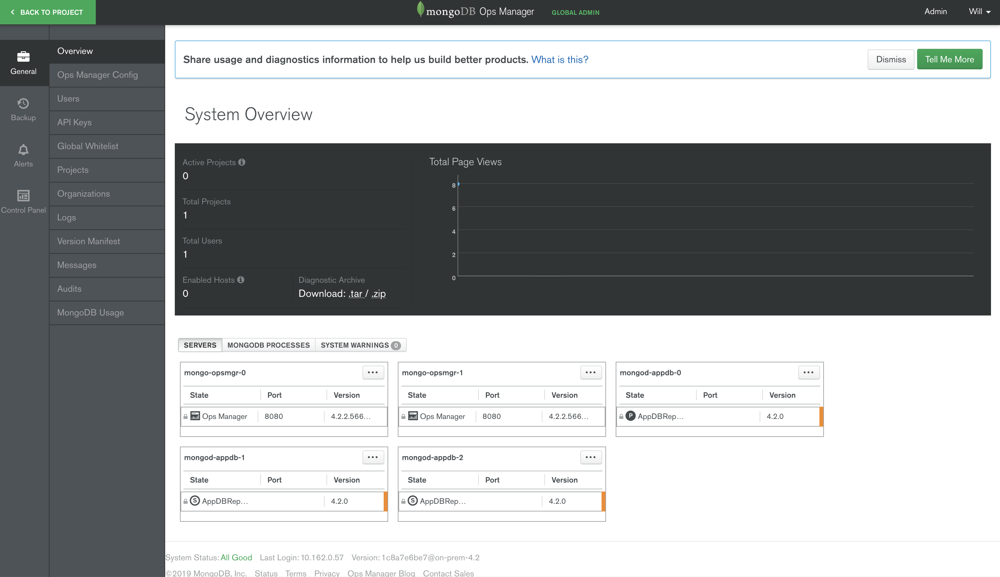

# MongoDB Ops Manager Demo for Kubernetes on GKE

An example project demonstrating the deployment of MongoDB Ops Manager via Kubernetes on the Google Kubernetes Engine (GKE), using the following Kubernetes' features: StatefulSet, Secrets, ConfigMap, Persistent Volumes and Persistent Volume Claims. Contains example Kubernetes YAML resource files (in the 'resource' folder) and associated Kubernetes based Bash scripts (in the 'scripts' folder) to configure the environment and deploy MongoDB Ops Manager, MongoDB Application DB, Oplog DB and Blockstore DB.

#### References
This builds upon the work done by Paul Done which can be found here: [http://k8smongodb.net/](http://k8smongodb.net/)

By default, this will use [Ops Manager 4.2.2](https://docs.opsmanager.mongodb.com/v4.2/release-notes/application/#onprem-server-4-2-2) (4.2.2.56673.20191001T1500Z-1).
This uses the Ops Manager 4.2.2 Docker image that was created using [mongodb-ops-manager-docker-image](https://github.com/wlchow/mongodb-ops-manager-docker-image)

## How To Run

### 1 Prerequisites

Ensure the following dependencies are already fulfilled on your host Linux/Windows/Mac Workstation/Laptop:

1. An account has been registered with the Google Compute Platform (GCP).
2. Follow the [Google Cloud SDK Quickstart](https://cloud.google.com/sdk/docs/quickstarts) for your Operating System and make sure GCP’s client command line tool `gcloud` has been installed on your local workstation. 
3. Your local workstation has been initialised to: (1) use your GCP account, (2) install the Kubernetes command tool (“kubectl”), (3) configure authentication credentials, and (4) set the default GCP zone to be deployed to:

    ```
    $ gcloud init
    $ gcloud components install kubectl
    $ gcloud auth application-default login
    $ gcloud config set compute/zone northamerica-northeast1-a
    ```

**Note:** To specify an alternative zone to deploy to, in the above command, you can first view the list of available zones by running the command: `$ gcloud compute zones list`

### 2 Deployment

Using a command-line terminal/shell, execute the following (first change the password variable NEW_PASSWORD in the script "deploy_ops_manager.sh", if appropriate):

    $ cd scripts
    $ ./gcp_setup.sh
    $ ./deploy_ops_manager.sh
    
This takes about 5 minutes to complete. Once completed, you should have MongoDB Ops Manager, MongoDB Application DB, Oplog DB and Blockstore DB secured and running in some Kubernetes StatefulSets. The executed bash script will have created the following resources:

* 2x Ops Manager Application Servers  (k8s deployment type: "StatefulSet")
* 1x MongoDB Application Database being a Replica Set containing 3x replicas (k8s deployment type: "StatefulSet")
* 1x MongoDB Oplog Database being a Replica Set containing 1x replicas (k8s deployment type: "StatefulSet")
* 1x MongoDB Blockstore Database being a Replica Set containing 1x replicas (k8s deployment type: "StatefulSet")

You can view the list of Pods that contain these MongoDB resources, by running the following:

    $ kubectl get pods


### 3 Google Cloud Configuration

In the [Google Cloud Platform Console](https://console.cloud.google.com), in the search box at the top, enter “Firewall” and select the matching suggestion "Firewall Rules VPC network”



Click “Create Firewall Rule” at the top to create a new rule to open up the needed port for our new server
Enter the following details and click “Create”:
```
Name: k8sopsmgrdemo
Targets: All instances in the network
Source IP ranges:  0.0.0.0/0
Protocols and ports:  
    tcp: 30000-32767
``` 


In the search box at the top, enter “Compute Engine” and select the matching suggestion "Compute Engine"


There should be three VM instances which are part of the GKE gke-ops-manager-demo-cluster cluster. Make a note of any one of the External IP addresses.


### 4 Ops Manager UI

Open a web browser and navigate to the Ops Manager home page to register the first user and to configure Ops Manager. Note that we have explicitly exposed NodePort 32008
```
http://<One of the External IP addresses>:32008
```


After you have configured it, look at the System Overview page


### 5 Undeploying & Tearing Down the Kubernetes Environment

**Important:** This step is required to ensure you aren't continuously charged by Google Cloud for an environment you no longer need.

Run the following script to undeploy the MongoDB Services & StatefulSets plus related Kubernetes resources, followed by the removal of the GCE disks before finally deleting the GKE Kubernetes cluster.

    $ ./teardown.sh
    
It is also worth checking in the [Google Cloud Platform Console](https://console.cloud.google.com), to ensure all resources have been removed correctly.
